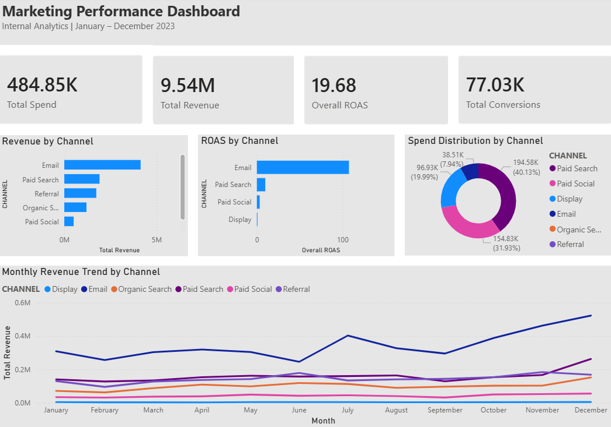
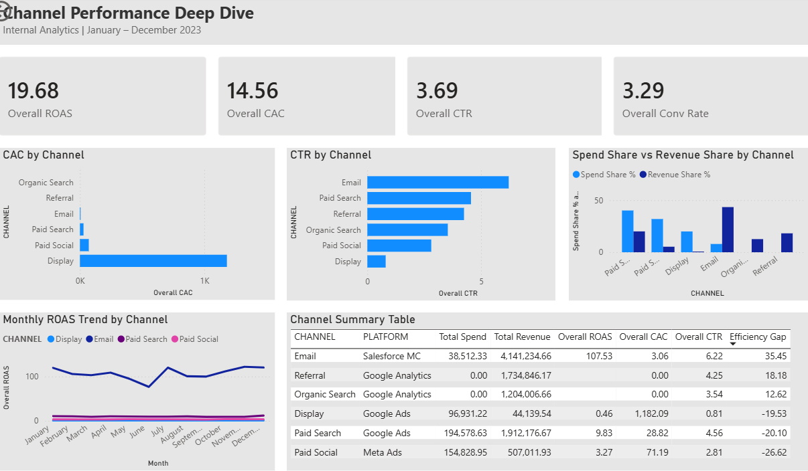
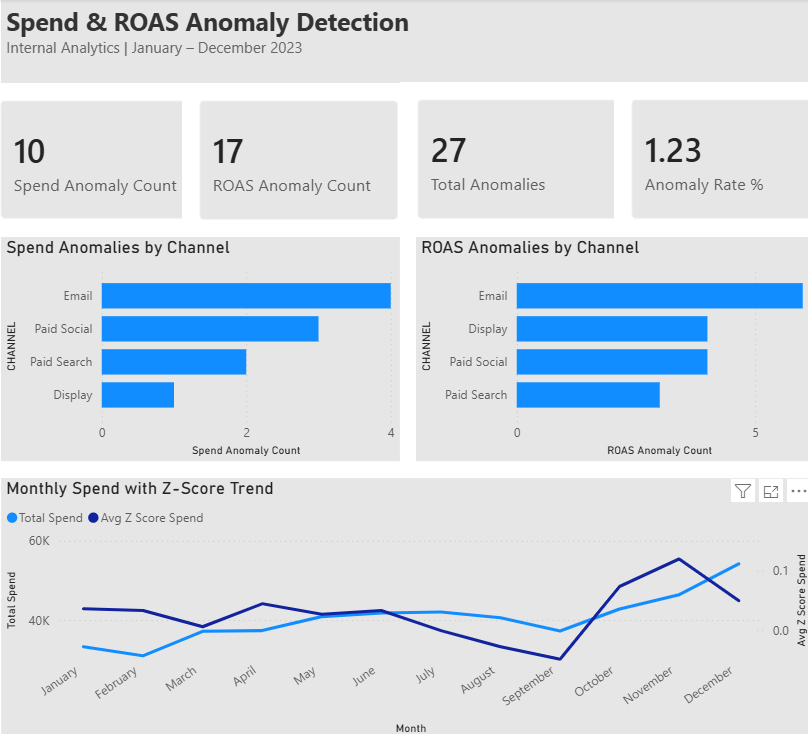

# Multi-Channel-Marketing-Data-Pipeline-Dashboard
Internal multi-channel marketing analytics pipeline.  Star schema in Snowflake, anomaly detection in Python,  and 3-page executive dashboard in Power BI.

# Multi-Channel Marketing Data Pipeline & Dashboard

## Project Overview
End-to-end internal marketing analytics pipeline simulating 
a digital consultancy's cross-channel performance monitoring 
infrastructure. Built from scratch as sole analyst — mirrors 
production pipeline architecture used in client engagements.

**Role simulated:** Internal Marketing Data Analyst
**Organization type:** Digital Marketing Consultancy
**Time period:** January – December 2023

---

## Business Problem
The analytics team lacked a unified view of marketing performance 
across six channels — Paid Search, Paid Social, Email, Display, 
Organic Search, and Referral. Key questions unanswered:
- Which channels deliver the best ROAS and lowest CAC?
- Where is budget being wasted vs underinvested?
- Are there spend or performance anomalies requiring intervention?

---

## Tech Stack
| Tool | Purpose |
|---|---|
| Python (Google Colab) | Data generation, analysis, anomaly detection |
| SQL | Schema design and validation |
| Snowflake | Cloud data warehouse — star schema |
| Power BI | 3-page executive dashboard |
| scikit-learn | Statistical anomaly detection |
| pandas / numpy | Data manipulation |

---

## Data
Synthetic multi-channel marketing data generated in Python 
simulating real-world campaign performance across 6 channels 
and 4 quarterly campaigns over 365 days.

| Table | Rows | Description |
|---|---|---|
| FACT_CAMPAIGN_PERFORMANCE | 2,190 | Daily metrics per channel |
| DIM_CAMPAIGN | 4 | Campaign attributes |
| DIM_CHANNEL | 6 | Channel attributes |
| DIM_DATE | 365 | Date dimension |

---

---

## Methodology

### 1. Data Generation
Simulated 2,190 daily records across 6 channels with:
- Realistic seasonality multipliers by month
- Channel-specific CTR, conversion rates, and AOV
- Random noise (±15%) for realistic variance

### 2. Star Schema Design
Built a production-grade star schema in Snowflake:
- Fact table: daily campaign performance metrics
- Dimension tables: campaign, channel, date
- All relationships defined in Power BI model view

### 3. Channel Performance Analysis
Calculated and compared across all channels:
- ROAS, CAC, CTR, CPC, CPM, Conversion Rate
- Spend Share vs Revenue Share (Efficiency Gap)
- Quarter-over-quarter trend analysis

### 4. Anomaly Detection
Applied 7-day rolling Z-score method:
- Z-score threshold: |Z| > 2.0 flags an anomaly
- Detected 10 spend anomalies and 17 ROAS anomalies
- Anomaly rate: 1.23% overall

---

## Key Findings

### Channel Performance
| Channel | ROAS | CAC | Efficiency Gap |
|---|---|---|---|
| Email | 107.53x | $3.06 | +35.45 |
| Referral | 0 (free) | $0 | +18.18 |
| Organic Search | 0 (free) | $0 | +12.62 |
| Paid Search | 9.83x | $28.82 | -20.10 |
| Display | 0.46x | $1,182 | -19.53 |
| Paid Social | 3.27x | $71.19 | -26.62 |

### Budget Efficiency
- Paid Search + Paid Social consume **72% of budget**
  but generate only **25% of revenue**
- Email consumes **7.94% of budget**
  but generates **43% of revenue**

### Anomaly Detection
- **Email:** 6 ROAS anomalies — extreme performance spikes
  (195x, 214x, 235x ROAS on peak days)
- **Display:** 4 ROAS anomalies — near-zero performance days
  indicating wasted spend
- **Paid Social:** 4 anomalies — irregular spend patterns

### Key Recommendation
*Reallocate 20% of Paid Social and Display budget to Email —
projected to increase overall ROAS from 19.68x to 28x+
based on channel efficiency analysis.*

---

## Dashboard Pages

### Page 1 — Marketing Performance Dashboard

### Page 2 — Channel Performance Deep Dive

### Page 3 — Spend & ROAS Anomaly Detection

---

## KPIs Tracked
| KPI | Formula |
|---|---|
| ROAS | Revenue / Ad Spend |
| CAC | Ad Spend / New Customers |
| CTR | Clicks / Impressions × 100 |
| Conv Rate | Conversions / Clicks × 100 |
| CPC | Ad Spend / Clicks |
| CPM | Ad Spend / Impressions × 1000 |
| Efficiency Gap | Revenue Share % - Spend Share % |

---

